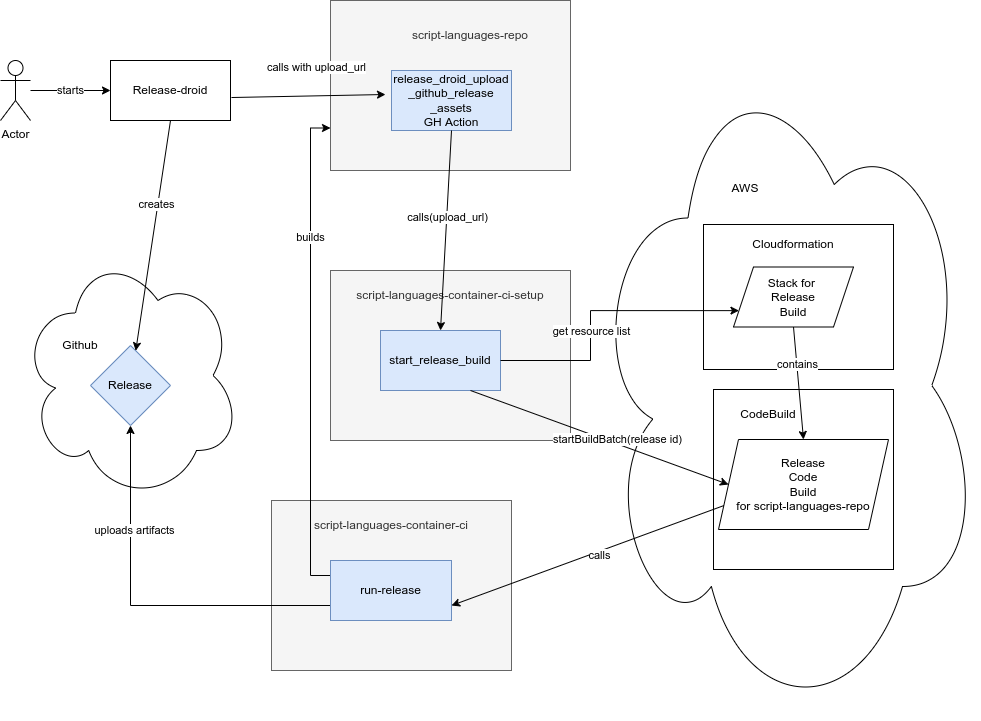

## Requirements

This package requires:
* Python (>=3.8)
* AWS CLI
* AWS profile

## Installation

You can install the latest wheel package from the [Github Release page](https://github.com/exasol/script-languages-container-ci-setup/releases):
`
pip install https://github.com/exasol/script-languages-container-ci-setup/releases/download/$RELEASE/exasol_script_languages_container_ci-setup-$RELEASE-py3-none-any.whl
`
(Replace $RELEASE with the actual release you are interested in)

## Usage

The following commands are available:
* `health` checks the current environment and setup of your AWS CLI installation
* `deploy-ci-build` deploys the AWS Cloudformation Stack which runs CodeBuild on the given AWS profile
* `deploy-source-credentials` deploys the AWS Cloudformation Stack for the source credentials
* `generate-buildspec` Generates the buildspec files for the given script language flavors.
* `validate-ci-build` validates the AWS Cloudformation Template for the CodeBuild stack on AWS with the given parameters
* `validate-source-credentials` validates the AWS Cloudformation Template for the source credentials stack on AWS with the given parameters.

## Requirements on AWS

The template expect to have 2 secrets stored on AWS' SecretManager for the respective AWS account:
* Dockerhub (having secret keys: `User` and `AccessToken`). Used to pull/push Docker images from Dockerhub during the CI jobs.
* A secret containing the GH username and personal-token. Used to register the webhook and interact with the Github repositories. 

## Deployements on AWS 

### Background

In order to accelerate the CI builds of the script language container we want to use AWS CodeBuild batch build, which enables us to run certain steps in parallel. As the number of flavor will change over time, this requires the generation of the buildspec again and again in the future. To simplify this process we created this project which automates the generation. Also we expect to have multiple repositories of the script language container in the future, each having it's own Code Build instance. With the automatic generation of the CodeBuild instances via AWS Cloudformation we can simplify this generation of new instances when we have new script language repositories.

#### Split of CodeBuild Stack and Source Credentials Stack

We have put the source credentials cloudformation specification in another file because AWS allows to have only one instance of SourceCredential per `ServerType` (GITHUB in our case). See https://thomasstep.com/blog/cloudformation-example-for-codebuild-with-a-webhook for more information.
This means the stack for source credentials needs to be deployed only once, and not per project.

### Deployments

There are currently 3 types of stacks to be deployed:
* The source credentials stack, named: `SLCSourceCredentials`. 
* Arbitrary number of stacks for the CI builds, named `${PROJECT}` (${PROJECT} is the name of the project given as argument)
* Arbitrary number of stacks for the release builds, named `${PROJECT}Release` (${PROJECT} is the name of the project given as argument)

#### SLCSourceCredentials

This is one stack containing the credentials to interact with all script-languages repositories.
It contains only one entity of type `AWS::CodeBuild::SourceCredential`.

#### CIBuild

There will be one code build stack for each repository. Each stack contains 
* roles for the CodeBuild, S3 artifact-Bucket and Batchbuild.
* A S3 Bucket for the artifacts of the build. The artifacts usually contain the logs of the `exaslct` runs.
* A policy for the S3 Bucket.
* The CodeBuild instance itself. It will be named `${PROJECT}CodeBuild`. (${PROJECT} is the name of the project given as argument)

#### Release-Build

For some repositories there will be one code build stack to build the release artifacts. Each stack contains 
* roles for the CodeBuild, S3 artifact-Bucket and Batchbuild.
* A S3 Bucket for the artifacts of the build. The artifacts usually contain the logs of the `exaslct` runs.
* A policy for the S3 Bucket.
* The CodeBuild instance itself. It will be named `${PROJECT}ReleaseCodeBuild`. (${PROJECT} is the name of the project given as argument)

### Flows

The overall flow for a release build is shown in the following diagram:
